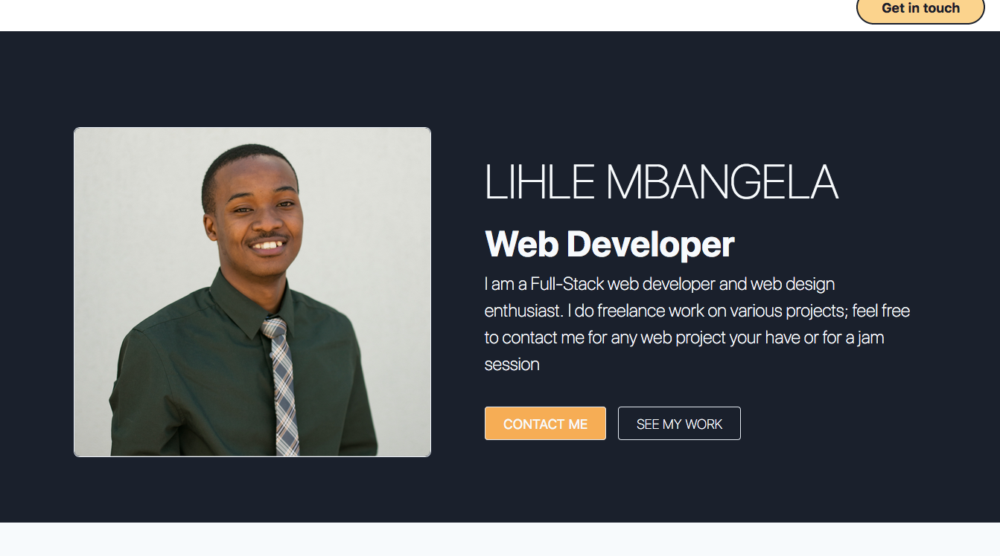

# mbangelalihle.portfolio
This is my first portfolio, it will change over time but this works for now...simple, clean and straight forward. It also contains a few projects, so I'll have yo build some more stuff to add some "color" to it.

# WHY?
Well I making it public to help someone starting out as well, so they can see that it can be easy...there's too many intimidating portfolios out there.
Moreover It is to serve as a motivator for me to keep creating, it becaomes too easy to be lazy when there's no specific projects to do; be it for school or for a job, but having a portfolio forces me to take on projects even if there are just for fun, because it would be strange to have an empty portfolio right...

# so there you have it, enjoy, leave a star, and connect if you have some cool stuff you'd like to buid together.
